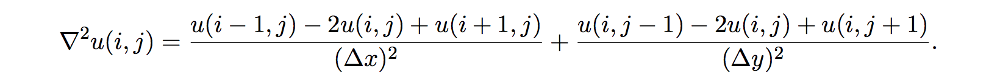
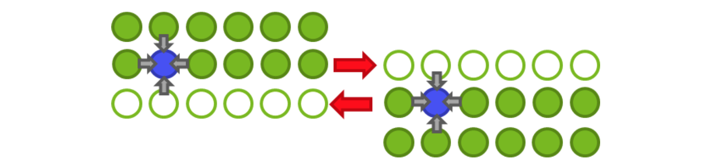

# Performance Engineering: Lab Session

We are going to work with a sample toy application that solves the 2D heat
equation (see the Appendix in this handout). You can download that from the
summer school web page.

If you prefer, you can as well work with your own code (or the code you are
working with) and experiment with the techniques discussed during the lectures.
You can do this in addition or in stead of working with the 2D heat equation
solver.

## 1. Porting and running

Clone the repository to Beskow, go to the folder ``mpi_p2p`` and compile the
program by doing``make``. See the Appendix for how to run the application and how
to view its results. Run the application (referring to what has been instructed
earlier during the summer school) with 2, 4 and 8 MPI ranks on Beskow, and
record the timings, using for now the same grid size for all of these.

## 2. First impressions

We will carry out a fast sampling experiment with the CrayPAT suite.

1. Do ``module load perftools-base`` followed by
   ``module load perftools`` and  ``module load cdt/17.10``
2. Rebuild your application (``make clean && make``)
3. Do ``pat_build -f heat_mpi`` (where ``heat_mpi`` is the name of your binary).
   You should get a new binary with ``+pat`` addition. The ``-f`` flag will 
   overwrite the ``heat_mpi+pat`` binary if it already exists.
4. Run ``heat_mpi+pat`` with 4 MPI ranks. You obtain a folder with a name like 
   ``heat_mpi+pat+...``, in addition to output files.
5. Do ``pat_report heat_mpi+pat+... > samp.4`` where
   ``heat_mpi+pat+...`` is the name of the folder you obtained in the last 
   step. This should produce the sampling report (file ``samp.4``) in the 
   current folder, and two other files with .apa suffix and .ap2 suffix in 
   the ``heat_mpi+pat+...`` folder.
6. Run ``heat_mpi+pat`` again but now with 8 MPI ranks. Apply ``pat_report``
   again (piping it now to ``samp.8`` or similar).
7. Compare the profiles ``samp.4`` and ``samp.8``.

**Question**: Can you already see the reason for the code not scaling?

## 3. Assessing scalability

Let us fix the user error first and turn off the single-writer I/O by adjusting
the parameter image interval in the file main.c to a value equalling to the
number of iterations plus one (e.g. 501). Then the heat field will be printed
only in the beginning and in the end of the simulation.

Run the binary with 32, 64 and 128 MPI tasks to get a scalability curve.

## 4. Performance analysis with CrayPAT

Once our "test case" is now a more sensible one, let us carry out a
proper performance analysis of the code.

1. Let us carry out an tracing experiment, tracing the user functions and those
   of the MPI library. Build a new instrumented binary by doing ``pat_build -f 
   -u -g mpi heat_mpi`` where the switch ``-u`` invokes the tracing of the user
   functions and ``-g mpi`` the MPI functions. See ``man pat_build`` for the
   possible tracing groups.
2. Run the obtained binary with (e.g.) 32 MPI ranks. You should get a new folder
   with a name like ``heat_mpi+pat+...``.
3. Apply ``pat_report`` again: ``pat_report (...) > tracing.32``, where
   ``(...)`` is the name of the latest folder. See ``pat_report -O
   help`` for available reports.
4. Read through the file ``tracing.32``.
5. Have a look also at the CrayPAT GUI by doing ``app2 (...)/index.ap2``, where
   ``(...)`` is the name of the latest folder.

**Question**: Which user routines consume most time?

**Question**: Where should we focus our efforts on next?

CrayPAT documentation is available via the ``pat_help`` utility, ``man intro_craypat``,
and/or at docs.cray.com.

## 5. Node-level performance analysis

Let us take a further look on the node-level performance.

+ Read the compiler optimization reports provided in the file core.lst.

  **Question**: Are the loops of the most time-consuming routines being vectorized?

+ Collect the hardware performance counters as follows:

  1. Reinstrument the binary as ``pat_build -f -u -g mpi -Drtenv=PAT_RT_PERFCTR=default heat_mpi``
  2. Run the obtained new binary
  3. Do ``pat_report -O profile+hwpc (...) > tracing.32.hwpc``

  This will report the sc. hardware performance counter values for L1 and L2
  cache utilization as well as something called Translation Lookaside Buffer
  (TLB) hit/miss ratios (you may want to google for that).

  **Question**: What are the L1 and L2 cache hit/miss ratios for the most time-consuming user routine?

The value ``default`` for ``-Drtenv=PAT_RT_PERFCTR`` collects the cache ratios
but can take other values as well. For instance, ``PAT_RT_PERFCTR=0`` will
return L1 cache hit ratios together with instruction/cycle metrics, and
``PAT_RT_PERFCTR=2`` will report L1, L2 and L3 cache hit ratios. There is also
a tool ``pat_hwpc`` for low-level performance analysis using the hardware
counters, but the L1 and L2 hit/miss ratios will suffice for now.

## 6. Node-level performance tuning

+ Let us fix the vectorization issue. Help the compiler to vectorize the loop
  in the evolve routine using techniques discussed in the lectures (``#pragma
  ivdep``) recompile the code, and read the compiler output. If the loop is
  indicated having been vectorized, run the code and compare the performance.

+ Let us try to improve the speed of floating point math. Apply these
  one-by-one and compare performance.

  - Replace the divisions in the evolve loop (in ``core.c``) with a multiplication
    by precomputed reciprocals (of the ``dx2`` and ``dy2`` variables). This needs to
    be done by hand.

  - Make the compiler to optimize more aggressively in terms of floating point
    precision by enabling the compiler flags ``-O3 -h fp4`` in the makefile.

**Question**: Which of these had an impact on the performance? Where we are now
compared to the out of the box performance?

## 7. Optimizing MPI

As the last exercise, let us see if we can improve the MPI performance.
Increase the grid size (e.g. 4096&times;4096) to see larger effects. For this we
will need to establish the scalability limit of the code and work within that.
An often used criterion is that the code scales, if increasing the number of
MPI tasks gives rise to a 1.5x speedup.

First, you will need to carry out the CrayPAT analysis as described in [Section
4](#sec4) on both sides of the scalability limit as discussed in the lectures.

**Question**: Can you identify why does the scaling stop?

Last, replace the blocking point-to-point communication with non-blocking
operations. You can take a shortcut and use the ready implementation of the
solver at the folder ``mpi_ip2p``. Skim through the code and compare differences.
Run it with the same core counts and compare performance. Remember to backport
the changes (including the Makefile) you have made for the node-level
performance optimization.

## 8. Summary

In this tutorial, we

+ Generated the profile (which routines take the most time) of an application
  and making some impressions of it
+ Collected hardware performance counters of the application
+ Measured the scalability curves of an application.

Even if the differences observed with the toy application were not that
impressive, the same tools and techniques are what we are using in performance
optimization of real-world applications and this exercise was just to get you
exposed with them.

## Appendix: 2D heat equation solver

The heat equation is a partial differential equation that describes the
variation of temperature in a given region over time

where _u_(_x_,_y_,_z_,_t_) represents temperature variation over space at a given
time, and &alpha; is a thermal diffusivity constant. We will limit ourselves onto
two dimensions (plane) and discretize the equation onto a grid. We can study
the development of the temperature grid with explicit time evolution over time
steps &Delta;_t_:

where the discretized Laplacian can be expressed as finite differences as

Here, &Delta;_x_ and &Delta;_y_ are the grid spacings of the temperature grid.

Parallelization of the program with MPI is pretty straightforward, the grid can
be divided to tasks and the tasks can update their parts of the grid
independently. The exception is the boundaries of the domains, where we need to
perform the “halo exchange”, i.e. before each step the last “true” column
handled by a task needs to be sent to a “ghost layer” of the neighboring task.

There a solver for the 2D heat equation implemented in C in this repository. The
solver develops the equation in a user-provided grid size and over the number
of time steps provided by the user. The default geometry is a disc, but user
can give other shapes as input files – a bottle is provided as an example (so
you can simulate how your beer will heat up when you take it to a sauna!). You
can compile the program by adjusting the Makefile as needed and typing ``make``.
Examples on how to run the binary (remember aprun on Cray XC)

+ ``./heat`` (no arguments - will run the program with default arguments, 2048&times;2048
  grid and 500 time steps)
+ ``./heat bottle.dat`` (one argument - will run the program starting from a
  temperature grid provided in the file bottle.dat for the default number of time
  steps, i.e. 500)
+ ``./heat bottle.dat 1000`` (two arguments - will run the program starting from a
  tem- perature grid provided in the file bottle.dat for 1000 time steps)
+ ``./heat 1024 2048 1000`` (three arguments - will run the program in a 1024&times;2048
  rect- angular grid for 1000 time steps)

The program will by default produce a .png image of the temperature field after
every 50 iterations. You can change that from the parameter ``image_interval``
defined in ``main.c``. You can view the images with some image viewer, e.g.
``eog``. If the ImageMagick utility is installed, you can generate an animation
of the pictures by ``animate heat*.png``.

